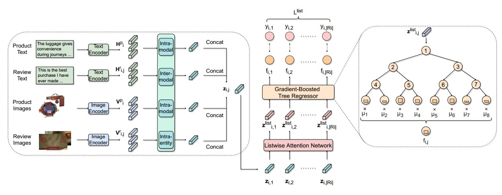

# Gradient-Boosted Decision Tree for Listwise Context Model in Multimodal Review Helpfulness Prediction

This repository includes the implementation of the paper [Gradient-Boosted Decision Tree for Listwise Context Model in Multimodal Review Helpfulness Prediction](https://arxiv.org/abs/2305.12678).
Thong Nguyen, Xiaobao Wu, Xinshuai Dong, Anh Tuan Luu, Cong-Duy Nguyen, Zhen Hai, Lidong Bing --- ACL 2023 (Findings)

For the Multimodal Review Helpfulness Prediction (MRHP) task, we introduce a novel framework to take advantage of the partitioned structure of the product review inputs and the ranking nature of the problem. Regarding the partitioned structure, we propose a gradient-boosted decision tree to route review features towards proper helpfulness subtrees managed by the decision nodes. For the ranking nature, we propose listwise attention network and listwise training objective to capture review list-contextualized context. Thorough analysis demonstrates both theoretical and empirical grounding of our approach in terms of model generalizability. Experiments on two large-scale MRHP datasets substantiate the state-of-the-art performance of our proposed framework.



For the Multimodal Review Helpfulness Prediction (MRHP) task, we introduce a novel framework to take advantage of the partitioned structure of the product review inputs and the ranking nature of the problem. Regarding the partitioned structure, we propose a gradient-boosted decision tree to route review features towards proper helpfulness subtrees managed by the decision nodes. For the ranking nature, we propose listwise attention network and listwise training objective to capture review list-contextualized context. Thorough analysis demonstrates both theoretical and empirical grounding of our approach in terms of model generalizability. Experiments on two large-scale MRHP datasets substantiate the state-of-the-art performance of our proposed framework.

## Requirements
- scikit-learn
- Pillowspacy
- torch
- tabulate
- nltk
- numpy
- tqdm
- dill
- hyperopt
- pandas
- networkx
- h5py
- coverage
- codecov
- pytest
- pytest-cov>=2.7.1
- cytoolz
- transformers
- prefetch_generator

## How to Run
1. To prepare the multimodal datasets of Lazada-MRHP and Amazon-MRHP, we follow the guideline provided here.
2. Run the following command to execute the training procedure:
``bash ./scripts/{dataset}/train_{segment}.sh``
For example,
    ```
    bash ./scripts/amazon/train_home.sh
    ```
    or
    ```
    bash ./scripts/amazon/train_clothing.sh
    ```
    
## Acknowledgement
Our implementation is based on the [MCR](https://github.com/jhliu17/MCR) code for the MRHP task.

## Citation
If you use this code, please cite the paper using the BibTex reference below.
```bibtex
@article{nguyen2023gradient,
  title={Gradient-Boosted Decision Tree for Listwise Context Model in Multimodal Review Helpfulness Prediction},
  author={Nguyen, Thong and Wu, Xiaobao and Dong, Xinshuai and Luu, Anh Tuan and Nguyen, Cong-Duy and Hai, Zhen and Bing, Lidong},
  journal={arXiv preprint arXiv:2305.12678},
  year={2023}
}
```